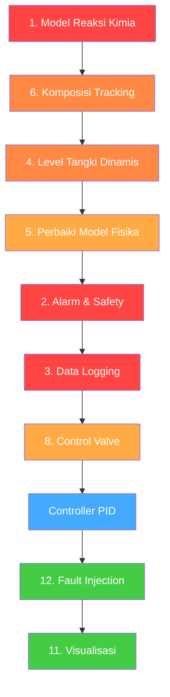

# 🔍 Analisis Kekurangan & Rekomendasi Modifikasi — Simulasi Leaching Nikel

> Dokumen ini mengidentifikasi hal-hal yang **kurang, perlu ditambah, atau perlu dimodifikasi** pada program simulasi leaching nikel — **di luar implementasi controller (PID)** yang sudah diketahui belum ada.

---

## Ringkasan Struktur Saat Ini

```
nikel production simulation/
├── main.py                      # Loop simulasi utama (Open-Loop)
├── actuator/
│   ├── pump.py                  # Aktuator pompa (orde-1)
│   └── reactor_heater.py        # Aktuator pemanas reaktor (orde-1)
├── plant/
│   ├── heaterTank.py            # Model preheater (steam-heated)
│   ├── reactor.py               # Model reaktor (electric heating + mixing)
│   └── vessel.py                # Model vessel flash tank
├── slurry/
│   ├── nikel_slurry.py          # Generator komposisi slurry
│   └── mixed_slurry.py          # Mixer acid + slurry
├── connection/
│   └── mqtt.py                  # MQTT publish/subscribe
└── controller/                  # ❌ Kosong (belum diimplementasi)
```

---

## 🔴 PRIORITAS TINGGI — Hal yang Perlu Ditambahkan

### 1. Model Reaksi Kimia Leaching (Tidak Ada Sama Sekali)

> [!CAUTION]
> Ini adalah **inti dari simulasi leaching** namun **sama sekali belum diimplementasi**. Tanpa ini, simulasi hanya menghitung perpindahan panas tanpa ada proses kimia.

**Masalah**: [reactor.py](file:///c:/Users/sutdon/Documents/siber fiskal/nikel production simulation/plant/reactor.py) hanya melakukan pemanasan listrik + mixing, tanpa model reaksi kimia.

**Yang perlu ditambahkan**:
- **Model kinetika leaching** — persamaan laju disolusi nikel (Ni), kobalt (Co), dan besi (Fe) dari ore ke dalam larutan asam
- **Efisiensi leaching** sebagai fungsi dari:
  - Suhu (semakin tinggi, semakin cepat)
  - Konsentrasi asam (pH)
  - Waktu retensi (residence time)
  - Ukuran partikel
- **Tracking komposisi sepanjang alur proses** — saat ini `mixed_comp` dari mixer tidak pernah diupdate setelah melewati reactor
- **Konsumsi asam sulfat** — asam berkurang saat bereaksi dengan mineral

**Contoh model sederhana (Shrinking Core Model)**:
```
dX/dt = k * exp(-Ea/RT) * (1-X)^(2/3) * [H2SO4]^n
```
Di mana X = konversi, k = konstanta laju, Ea = energi aktivasi, T = suhu absolut.

---

### 2. Sistem Alarm & Safety Interlock

> [!WARNING]
> Tidak ada mekanisme keselamatan sama sekali. Dalam simulasi industri nyata, ini wajib ada.

**Yang perlu ditambahkan**:
| Parameter | Alarm Low | Alarm High | Trip/Interlock |
|-----------|-----------|------------|----------------|
| Suhu Reactor | < 150°C (warning) | > 270°C (high-high) | Matikan heater |
| Tekanan Reactor | < 5 bar | > 40 bar | Emergency vent |
| Suhu Vessel | - | > 200°C | Kurangi flow |
| Flow Slurry | < 10 m³/h (low) | > 120 m³/h (high) | Matikan pump |
| pH Campuran | < 0.5 (terlalu asam) | > 4.0 (kurang asam) | Adjust acid pump |
| Level Tank | < 20% | > 90% | Control valve |

**Implementasi**: Buat modul `safety/alarm.py` dengan fungsi pengecekan batas dan MQTT topic untuk alarm.

---

### 3. Data Logging & Historian

**Masalah**: Tidak ada penyimpanan data simulasi. Semua data hilang saat program berhenti.

**Yang perlu ditambahkan**:
- **CSV/SQLite logger** — simpan semua variabel proses per time step
- **Timestamp** pada setiap data point
- **Trend data** untuk analisis post-run
- **Export ke format yang bisa dibaca Excel/MATLAB**

**Contoh struktur log**:
```csv
timestamp, ph1_temp, ph2_temp, r1_temp, r2_temp, v1_temp, v2_temp, flow, pressure, ...
```

---

### 4. Tracking Level/Volume Tangki

**Masalah**: Semua tangki (preheater, reactor, vessel) tidak melacak level cairan. Parameter `liquid_height` di [heaterTank.py](file:///c:/Users/sutdon/Documents/siber fiskal/nikel production simulation/plant/heaterTank.py#L42), [reactor.py](file:///c:/Users/sutdon/Documents/siber fiskal/nikel production simulation/plant/reactor.py#L44), dan [vessel.py](file:///c:/Users/sutdon/Documents/siber fiskal/nikel production simulation/plant/vessel.py#L51) adalah **konstanta tetap**, bukan variabel dinamis.

**Yang perlu dimodifikasi**:
- `liquid_height` harus menjadi **state variable** yang berubah berdasarkan:
  - Flow masuk vs flow keluar
  - Volume steam yang keluar (vessel)
  - Geometri tangki (diameter, tinggi total)
- Pressure harus bergantung pada level aktual, bukan height tetap
- Deteksi **overflow** dan **empty tank**

---

## 🟡 PRIORITAS MENENGAH — Modifikasi yang Diperlukan

### 5. Model Fisika yang Perlu Diperbaiki

#### 5a. Preheater — Heat Exchange Terlalu Sederhana
**File**: [heaterTank.py](file:///c:/Users/sutdon/Documents/siber fiskal/nikel production simulation/plant/heaterTank.py)

- **Masalah**: Steam flow digunakan hanya sebagai kondisi boolean (`if steam_flow > 0`), bukan mempengaruhi besarnya perpindahan panas secara kuantitatif
- **Perbaikan**: `Q_steam` harus juga bergantung pada `steam_flow`:
  ```python
  # Saat ini (salah):
  Q_steam = UA * (steam_temp - current_temp)  # steam_flow diabaikan!
  
  # Seharusnya:
  Q_steam = min(UA * (steam_temp - current_temp), 
                steam_flow * latent_heat / 3600)  # dibatasi oleh energi steam
  ```

#### 5b. Vessel — Flash Calculation Stabilitas Numerik
**File**: [vessel.py](file:///c:/Users/sutdon/Documents/siber fiskal/nikel production simulation/plant/vessel.py)

- **Masalah**: `Q_excess = M_tank * Cp * (temp_mixed - T_sat)` menggunakan **seluruh massa tangki**, bukan hanya massa yang masuk per step. Ini membuat flash calculation tidak proporsional terhadap laju alir.
- Penggunaan **dua persamaan Antoine yang berbeda** (`_vapor_pressure_bar` dan `_saturation_temp`) yang hasilnya tidak saling konsisten (koefisien berbeda).
- **Cap 5% per step** (`M_water * 0.05`) bersifat arbitrary dan tidak skalabel terhadap dt.

#### 5c. Reactor Heater Actuator — Target Suhu Referensi
**File**: [reactor_heater.py](file:///c:/Users/sutdon/Documents/siber fiskal/nikel production simulation/actuator/reactor_heater.py)

- **Masalah**: `target_temp = ambient_temp + K * heat_input` — target selalu relatif terhadap **ambient** (34°C), bukan terhadap `current_temp`. Artinya jika slurry masuk pada 150°C, heater tetap mengacu 34°C sebagai base, sehingga di reactor model mixing + heating bisa menghasilkan perilaku yang unexpected.
- **Ini adalah design choice** yang patut ditinjau ulang apakah sudah sesuai keinginan.

#### 5d. Heat Loss ke Lingkungan Tidak Dimodelkan
- Tidak ada satu pun unit yang memodelkan **heat loss** ke lingkungan
- Seharusnya ada term: `Q_loss = UA_ambient * (current_temp - ambient_temp)`
- Relevan terutama untuk preheater dan vessel

---

### 6. Komposisi Slurry Tidak Berubah Sepanjang Proses

**Masalah**: `generate_slurry()` dipanggil **setiap iterasi** di [main.py:96](file:///c:/Users/sutdon/Documents/siber fiskal/nikel production simulation/main.py#L96), menghasilkan komposisi baru setiap 0.1 detik. Ini tidak realistis.

**Yang perlu dimodifikasi**:
- Slurry generator seharusnya dipanggil **sekali per batch** atau berubah perlahan (drift)
- Komposisi harus **di-track sepanjang proses** (dari mixer → preheater → reactor → vessel)
- Setelah leaching, kadar Ni dalam solid harus **berkurang** dan Ni dalam larutan harus **bertambah**

---

### 7. MQTT — Robustness & Error Handling

**File**: [mqtt.py](file:///c:/Users/sutdon/Documents/siber fiskal/nikel production simulation/connection/mqtt.py)

**Masalah yang ditemukan**:

| Issue | Detail |
|-------|--------|
| **Reconnect logic** | Tidak ada auto-reconnect jika koneksi terputus di tengah simulasi |
| **Global variables** | Setpoint disimpan sebagai `global` variables — tidak thread-safe |
| **No validation** | Payload dari AVEVA tidak divalidasi (bisa string kosong, NaN, negatif) |
| **No QoS handling** | Menggunakan QoS 1 tapi tidak ada handler untuk delivery failure |
| **Deprecated API** | `mqtt.Client(client_id=...)` tanpa `callback_api_version` akan deprecated di paho-mqtt v2.x |

**Rekomendasi**:
- Gunakan **class-based state** alih-alih global variables
- Tambahkan **input validation** dan **default fallback**
- Implementasi **reconnect callback** dengan exponential backoff
- Tambahkan **heartbeat/watchdog** topic

---

### 8. Valve/Control Valve Tidak Ada

**Masalah**: Dalam proses leaching nyata, **control valve** digunakan di banyak titik:
- Valve antara vessel 1 → vessel 2 (mengatur pressure drop)
- Valve pada steam line
- Emergency shutoff valve

**Yang perlu ditambahkan**: Modul `actuator/valve.py` dengan model:
- Karakteristik valve (linear, equal percentage, quick opening)
- Response time (orde 1)
- Fail-safe position (fail-open / fail-close)

---

## 🟢 PRIORITAS RENDAH — Nice-to-Have

### 9. Struktur Kode & Arsitektur

| Issue | Detail | Rekomendasi |
|-------|--------|-------------|
| **Duplikasi kode** | `_clamp()` dan `_vapor_pressure_bar()` didefinisikan ulang di 3 file | Pindahkan ke `utils/thermodynamics.py` |
| **Tidak ada `__init__.py`** | Semua package (`actuator/`, `plant/`, `slurry/`, `connection/`) tidak punya `__init__.py` | Tambahkan untuk proper Python packaging |
| **Magic numbers** | Banyak konstanta hardcoded (e.g., `2260.0` kJ/kg, `1400` kg/m³) tanpa penjelasan | Pindahkan ke `config.py` atau `constants.py` |
| **Tidak ada unit test** | Tidak ada satu pun test file | Buat `tests/` directory dengan unit test per modul |
| **Tidak ada requirements.txt** | Dependency `paho-mqtt` tidak terdokumentasi | Buat `requirements.txt` |

---

### 10. Simulasi Time Management

**Masalah** di [main.py](file:///c:/Users/sutdon/Documents/siber fiskal/nikel production simulation/main.py):
- `time.sleep(DT)` menyebabkan **drift waktu** — karena komputasi juga butuh waktu, actual step > DT
- Tidak ada opsi **fast simulation** (tanpa real-time delay)
- Tidak ada opsi **slow motion** untuk debugging

**Rekomendasi**:
```python
# Gunakan wall-clock correction
next_tick = time.monotonic() + DT
# ... (simulasi) ...
sleep_time = next_tick - time.monotonic()
if sleep_time > 0:
    time.sleep(sleep_time)
```

Atau tambahkan parameter `speed_factor` untuk mempercepat/memperlambat simulasi.

---

### 11. Visualisasi & Dashboard Real-Time

**Masalah**: Output hanya berupa print ke console — sulit untuk menganalisis tren.

**Rekomendasi**:
- Integrasi dengan **Grafana** (via MQTT/InfluxDB) untuk dashboard real-time
- Atau buat **matplotlib live plot** sederhana untuk development/debugging
- Tambahkan **web dashboard** menggunakan Flask/Streamlit

---

### 12. Skenario Gangguan & Fault Injection

**Tidak ada kemampuan untuk mensimulasikan**:
- **Pump failure** (tiba-tiba berhenti)
- **Heater burn-out** (resistance naik drastis)
- **Pipe blockage** (flow terhambat)
- **Sensor noise/drift** (pembacaan sensor tidak akurat)
- **Steam leak** (kehilangan energi)

Ini penting untuk menguji **robustness controller** nantinya.

---

## 📋 Tabel Ringkasan Prioritas

| # | Item | Prioritas | Kompleksitas | File Terdampak |
|---|------|-----------|-------------|----------------|
| 1 | Model reaksi kimia leaching | 🔴 Tinggi | Tinggi | `plant/reactor.py`, baru: `chemistry/` |
| 2 | Sistem alarm & safety | 🔴 Tinggi | Sedang | Baru: `safety/alarm.py`, `main.py` |
| 3 | Data logging & historian | 🔴 Tinggi | Rendah | Baru: `logger/`, `main.py` |
| 4 | Tracking level tangki | 🔴 Tinggi | Sedang | `plant/heaterTank.py`, `reactor.py`, `vessel.py` |
| 5 | Perbaikan model fisika | 🟡 Menengah | Sedang | `plant/heaterTank.py`, `vessel.py`, `actuator/reactor_heater.py` |
| 6 | Komposisi slurry tracking | 🟡 Menengah | Sedang | `main.py`, `slurry/`, `plant/` |
| 7 | MQTT robustness | 🟡 Menengah | Rendah | `connection/mqtt.py` |
| 8 | Control valve model | 🟡 Menengah | Sedang | Baru: `actuator/valve.py` |
| 9 | Refactor arsitektur kode | 🟢 Rendah | Rendah | Semua file |
| 10 | Time management | 🟢 Rendah | Rendah | `main.py` |
| 11 | Visualisasi dashboard | 🟢 Rendah | Sedang | Baru: `visualization/` |
| 12 | Fault injection | 🟢 Rendah | Sedang | Semua aktuator & plant |

---

## Rekomendasi Urutan Pengerjaan



> [!IMPORTANT]
> **Model reaksi kimia leaching (item #1)** adalah kekurangan paling kritis karena merupakan inti dari simulasi "leaching". Tanpa ini, program hanya simulasi perpindahan panas, bukan simulasi leaching nikel yang sebenarnya.
